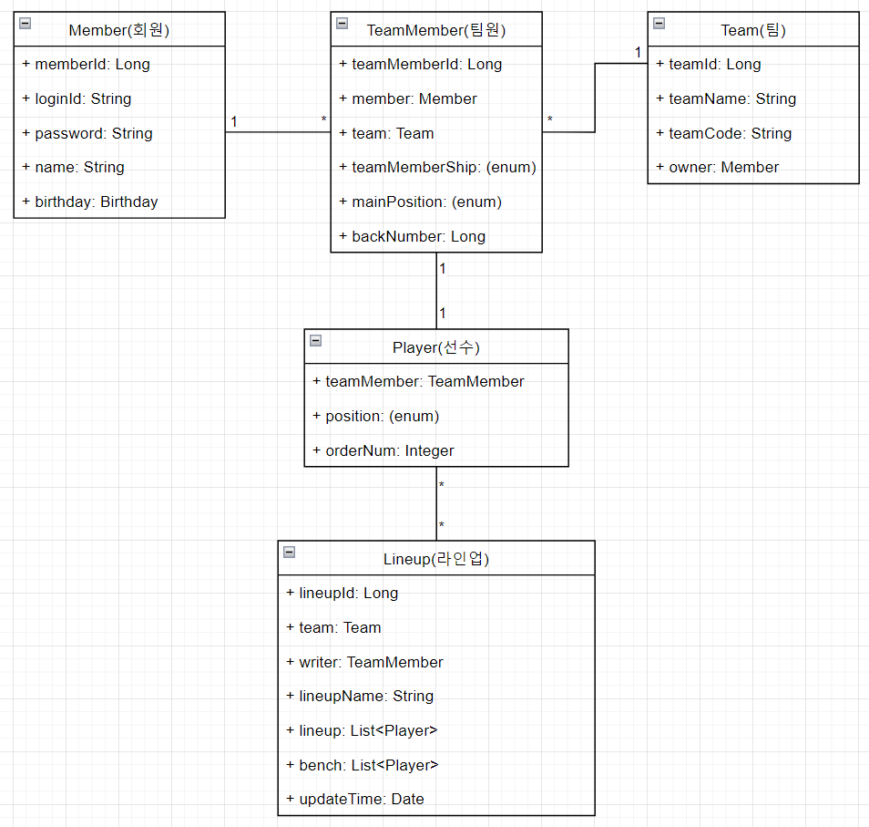

# 야구팀 관리 시스템

# 목적

- 구체적인 설계를 우선으로 한다
- 회원 가입을 구현해본다
- 설계에 맞게 프로그램을 구현한다

# 요구사항

## 회원(Member)

- 간단한 절차로 회원 가입이 가능하도록 한다
- 회원은 팀을 생성할 수 있다
- 회원은 팀에 가입 신청을 할 수 있다
- 팀에서 관리 권한이 있는 회원은 팀 가입 신청, 라인업 관리 등을 조작할 수 있다

## 팀(Team)

- 팀원 관리, 권한 부여 등을 할 수 있다
- 라인업을 만들고 저장할 수 있다

## 팀원(TeamMember)

## 선수(Player)

## 라인업(Lineup)

- 9명 이상의 회원이 있는 팀에서 라인업을 만들 수 있다
- 라인업의 타순이나 포지션을 자유롭게 변경할 수 있다

# 페이지

## 메인페이지

- 메인화면 - GET - `“/”`

## 로그인

- 로그인 - GET - `“/login”`
    - 요청 - POST - `“/login”`
- 로그아웃 - POST - `“/logout”`

## 회원

### 회원

- 회원정보 - GET - `“/member/{memberId}”`
- 회원목록 - GET  - `“/member/members”`
- 내 정보 - GET - `“/member/myPage”`
    - 수정 - GET - `“/member/editMember”`
        - 요청 - POST - `“/member/editMember”`

### 회원가입

- 회원가입 - GET  - `“/member/signUpMember”`
    - 요청 - POST - `“/member/signUpMember”`

## 팀

- 팀 목록 - GET - `“/team/teams”`
- 팀 정보 - GET - `“/team/{teamCode}”`
- 팀 생성 - GET - `“/team/createTeam”`
    - 요청 - POST - `“/team/createTeam”`

## 팀원

- 팀원 정보 - GET - `“/teamMember/{teamMemberId}”`
- 팀 가입 - GET - `“/teamMember/joinTeam/{teamCode}”`
    - 요청 - POST - `“/teamMember/joinTeam/{teamCode}”`
- 관리자의 팀원 정보 수정 - GET - `“/teamMember/{teamMemberId}/manage"`
    - 요청 - POST - `“/teamMember/{teamMemberId}/manage"`

## 라인업

- 라인업 목록 - GET - `“/lineup/{teamCode}/list”`
- 라인업 내용 - GET - `“/lineup/{teamCode}/{lineupId}”`
- 라인업 작성 - GET - `“/lineup/{teamCode}/create”`
    - 타순 교체 - POST - `“/lineup/{teamCode}/changeOrder”`
    - 포지션 교체 - POST - `“/lineup/{teamCode}/changePosition”`
    - 요청 - POST - `“/lineup/{teamCode}/create”`
- 라인업 수정 - GET - `“/lineup/{teamCode}/{lineupId}/edit”`
    - 요청 - POST - `“/lineup/{teamCode}/{lineupId}/edit”`
- 다른 이름으로 저장 - POST - `“/lineup/{teamCode}/{lineupId}/saveAS”`
- 라인업 삭제 - POST - `“/lineup/{teamCode}/{lineupId}/delete”`